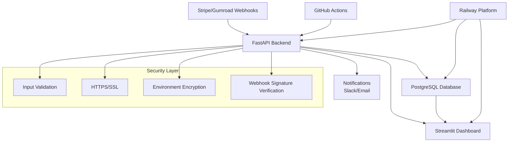

[](https://github.com/abranch43/branchbot-deploy/actions/workflows/ci.yml)

# branchbot-deploy

[](https://github.com/abranch43/branchbot-deploy/actions)
[](https://opensource.org/licenses/MIT)
[](https://www.python.org/downloads/)
[](https://github.com/PyCQA/bandit)
[](https://github.com/psf/black)

> **One-Click Deploy Revenue Tracker**  
> Enterprise-grade API + Dashboard + PostgreSQL setup via Railway with automated security, CI/CD, and contributor workflows!

---

## 📋 Table of Contents

- [Quick Start](#🚀-deploy-now)
- [Architecture](#🏗️-architecture)
- [Features](#✅-whats-included)
- [Deploy Steps](#🛠️-deploy-steps-super-short)
- [Webhook Configuration](#🕹️-webhook-configuration)
- [Local Development](#🧑‍💻-local-development-optional)
- [Security](#🔒-security)
- [Contributing](#🤝-contributing)
- [Documentation](#📚-documentation)
- [License](#📝-license)

---

## 🚀 Deploy Now
[](https://railway.app/new/template?sourceRepo=https://github.com/abranch43/branchbot-deploy)

## 🤖 AI-Verified by Codex

- **IDE extension:** get inline AI guidance as you code.
- **Cloud↔local handoff:** move changes between environments seamlessly.
- **GitHub PR reviews:** Codex reviews every pull request for security, tests, and style.

---

## ✅ What's Included

- **One-Click Railway Deploy:**  
  Provisions API, Dashboard, and PostgreSQL automatically.
- **Step-by-Step Setup:**  
  Deploy, configure webhooks, and go live!
- **Environment Variables Guide:**  
  All required and optional configs.
- **Webhook Configuration:**  
  Exact URLs for Stripe & Gumroad, plus test commands.
- **Project Structure:**  
  Visual map of the codebase.
- **Local Development:**  
  Easy instructions for running locally.

---

## 🏗️ Architecture



### Core Components

- **FastAPI Backend**: Handles webhook processing, data validation, and API endpoints
- **Streamlit Dashboard**: Real-time revenue visualization with auto-refresh
- **PostgreSQL Database**: Persistent data storage with Railway-managed backups
- **Security Layer**: Enterprise-grade security with input validation and encryption
- **CI/CD Pipeline**: Automated testing, security scanning, and deployment

---

## 🛠️ Deploy Steps (Super Short)

1. **Click Deploy:**  
   - Use the Railway Deploy button above.

2. **Set Variables in Railway:**  
   - `STRIPE_WEBHOOK_SECRET` (starts with whsec_...)
   - `GUMROAD_WEBHOOK_SECRET` (any shared secret you’ll also use in Gumroad)
   - (optional) `OPENAI_API_KEY`, `SLACK_WEBHOOK_URL`
   - `SAFE_MODE=true` (disables risky external integrations in prod)

3. **Wait for branchberg-api to turn green**  
   - Copy its Public Domain.

4. **Health check:**  
   - Visit: `https://<API>/health`  
   - Should return: `{"status":"ok"}`

5. **Point webhooks to these endpoints:**  
   - **Stripe:** `https://<YOUR-API-DOMAIN>/webhooks/stripe`
   - **Gumroad:** `https://<YOUR-API-DOMAIN>/webhooks/gumroad`

6. **Open your dashboard service URL**  
   - Totals will auto-refresh every ~10s.

---

## 🕹️ Webhook Configuration

- **Stripe:**  
  - Go to Stripe Dashboard → Developers → Webhooks
  - Add endpoint:  
    ```
    https://<YOUR-API-DOMAIN>/webhooks/stripe
    ```
  - Use signing secret: `STRIPE_WEBHOOK_SECRET`

- **Gumroad:**  
  - Go to Gumroad Settings → Advanced → Webhooks
  - Add endpoint:  
    ```
    https://<YOUR-API-DOMAIN>/webhooks/gumroad
    ```
  - Use signing secret: `GUMROAD_WEBHOOK_SECRET`

---

## 🧪 Quick Live Test

**Stripe (from your machine):**
```bash
stripe listen --forward-to https://<YOUR-API-DOMAIN>/webhooks/stripe
stripe trigger checkout.session.completed
```

**Gumroad (test):**
```bash
curl -X POST https://<YOUR-API-DOMAIN>/webhooks/gumroad \
  -F seller_id=dummy -F product_id=toolkit -F email=tester@example.com \
  -F price=89700 -F currency=USD -F order_number=ORD123 \
  -F signature=$(python - <<'PY'
import hmac,hashlib;print(hmac.new(b'YOUR_SHARED_SECRET', b'ORD123', hashlib.sha256).hexdigest())
PY)
```

---

## ⚡ Project Structure

```
branchbot-deploy/
├── api/               # FastAPI backend (webhooks, DB)
├── dashboard/         # Streamlit dashboard (auto-refresh)
├── database/          # PostgreSQL models/migrations
├── README.md
├── requirements.txt
└── railway.json       # Railway project config
```

- **`api/`**: Handles Stripe & Gumroad webhooks, revenue calculations
- **`dashboard/`**: Live revenue, event feed (auto-refresh)
- **`database/`**: PostgreSQL schema & migrations

---

## 🧑‍💻 Local Development (Optional)

### Quick Start

1. **Clone & Setup:**
   ```bash
   git clone https://github.com/abranch43/branchbot-deploy.git
   cd branchbot-deploy
   python -m venv .venv
   ```

2. **Activate Virtual Environment:**
   
   **Windows (PowerShell):**
   ```powershell
   .\.venv\Scripts\Activate.ps1
   ```
   
   **Windows (Command Prompt):**
   ```cmd
   .venv\Scripts\activate.bat
   ```
   
   **macOS/Linux:**
   ```bash
   source .venv/bin/activate
   ```

3. **Install Package (Recommended):**
   
   **For users:**
   ```bash
   pip install -e .
   ```
   
   **For developers (includes ruff, mypy, pytest):**
   ```bash
   pip install -e .[dev]
   ```
   
   **Alternative (legacy method):**
   ```bash
   pip install -r requirements.txt
   ```

4. **Configure Environment (Optional):**
   - Copy `.env.example` to `.env` (already gitignored)
   - Add your secrets if testing webhooks:
     ```
     STRIPE_WEBHOOK_SECRET=your_stripe_secret
     GUMROAD_WEBHOOK_SECRET=your_gumroad_secret
     OPENAI_API_KEY=your_openai_key  # (optional)
     SLACK_WEBHOOK_URL=your_slack_url  # (optional)
     ```

### Running the Services

#### Option 1: Automated Start (Windows PowerShell)
```powershell
.\scripts\run-local.ps1
```
This script will:
- Activate the virtual environment
- Start the API on `http://localhost:8000`
- Start the dashboard on `http://localhost:8502`

#### Option 2: Manual Start

**Terminal 1 - API Backend:**
```bash
uvicorn branchberg.app.main:app --reload --port 8000
```
API will be available at: `http://localhost:8000`  
API docs: `http://localhost:8000/docs`

**Terminal 2 - Streamlit Dashboard:**
```bash
streamlit run branchberg/dashboard/streamlit_app.py --server.port 8502
```
Dashboard will be available at: `http://localhost:8502`

### Testing the API

Once running, test the API health:
```bash
curl http://localhost:8000/
```

Add a manual transaction:
```bash
curl -X POST http://localhost:8000/ingest/manual \
  -H "Content-Type: application/json" \
  -d '{"amount": 100.50, "currency": "USD", "description": "Test transaction"}'
```

### Troubleshooting

- **Imports failing?** Make sure you've installed the package with `pip install -e .` or `pip install -e .[dev]`
- **Port already in use?** Change ports with `--port` (uvicorn) or `--server.port` (streamlit)
- **API not connecting?** Ensure `API_URL=http://localhost:8000` is set for the dashboard

---

## 💰 Live Revenue Tracking

Once deployed, your dashboard shows:

- **Real-time revenue metrics:**  
  - Today, This Week, All-Time totals
- **Live event feed:**  
  - Timestamps, amounts, event types
- **Auto-refresh:**  
  - Updates every 10 seconds
- **Test events:**  
  - Demo data for Stripe/Gumroad

---

## 🎯 What Happens When You Click Deploy?

- **Railway provisions:**
  - `branchberg-api` service (FastAPI backend)
  - `branchberg-dashboard` service (Streamlit dashboard)
  - **PostgreSQL** database (shared for both services)
  - **SSL Certificates** (HTTPS by default)

---

## ❓ FAQ

- **API 404?**  
  Make sure it’s `/webhooks/...` plural.

- **Dashboard shows $0?**  
  Trigger the tests above; then refresh.

- **Health not OK?**  
  Check Railway logs on branchberg-api; verify `DATABASE_URL` exists (Postgres plugin).

---

## 🔒 Security

Security is a top priority for branchbot-deploy. We implement enterprise-grade security practices:

### 🛡️ Security Features

- **Webhook Signature Verification**: All webhooks are cryptographically verified
- **Input Validation**: All inputs are validated and sanitized
- **Environment Encryption**: Sensitive data encrypted at rest and in transit
- **Automated Security Scanning**: GitHub's security features enabled
- **Dependency Updates**: Automated via Dependabot
- **Secret Management**: No secrets in code, environment variables only

### 🚨 Reporting Security Issues

Please see our [Security Policy](SECURITY.md) for reporting security vulnerabilities.

### 🔧 Security Best Practices

- Always use `SAFE_MODE=true` in production
- Rotate webhook secrets regularly
- Monitor Railway access logs
- Enable 2FA on all accounts

---

## 🤝 Contributing

We welcome contributions from the community! Please see our [Contributing Guide](CONTRIBUTING.md) for detailed instructions.

### Quick Start for Contributors

1. **Fork and clone the repository**
2. **Install dev dependencies**: `pip install -e .[dev]`
3. **Run tests**: `pytest`
4. **Run linters**: `ruff check .` and `mypy .`
4. **Make your changes following our style guide**
5. **Submit a pull request**

### 📋 Development Standards

- **Code Style**: PEP 8 with 4-space indentation
- **Testing**: All changes must include tests
- **Documentation**: Update docs for new features
- **Security**: Never commit secrets or sensitive data

---

## 📚 Documentation

### 📖 Available Documentation

- **[Contributing Guide](CONTRIBUTING.md)**: How to contribute to the project
- **[Security Policy](SECURITY.md)**: Security guidelines and reporting
- **[API Documentation](#)**: Coming soon - API endpoint documentation
- **[Deployment Guide](#🛠️-deploy-steps-super-short)**: Step-by-step deployment instructions

### 🔗 External Resources

- **[Railway Documentation](https://docs.railway.app)**: Platform-specific guides
- **[Stripe Webhooks](https://stripe.com/docs/webhooks)**: Webhook configuration
- **[Gumroad API](https://help.gumroad.com/article/280-webhooks)**: API integration guide

---

## 📝 License

This project is licensed under the MIT License - see the [LICENSE](LICENSE) file for details.

### Open Source Compliance

- **MIT License**: Permissive open source license
- **Commercial Use**: Allowed for commercial applications
- **Modification**: Freely modify and distribute
- **Attribution**: Please retain original copyright notice

### Third-Party Licenses

This project uses open source software. All dependencies maintain their respective licenses.

---

> Ready for $50K/month live revenue tracking? Paste, commit, deploy – you're done!


## Services
- **Ship-Safe Repo™** — CI + Pre-Commit + AI Review in 24 hours. See [offer PDF](docs/Ship-Safe-Repo_Offer_APlus_Enterprise.pdf).

---

## Empire OS Brief

The **Empire OS Brief** is a strategic document outlining the vision for modern financial infrastructure for government contractors and enterprise operators. It provides context on:

- The problem: scattered revenue, blind spots, and month-end surprises
- The solution: unified ledger, real-time insights, and automated alerts
- The approach: ship-safe repositories, Railway deployment, and production-grade security
- Business context: SDVOSB/MBE certifications, federal compliance, and modern DevOps

**Note:** The Empire OS Brief PDF is maintained as an external asset and is not tracked in this repository. It is available upon request or as an attachment in campaign materials. See `EMAIL_CAMPAIGN.md` for distribution details.



